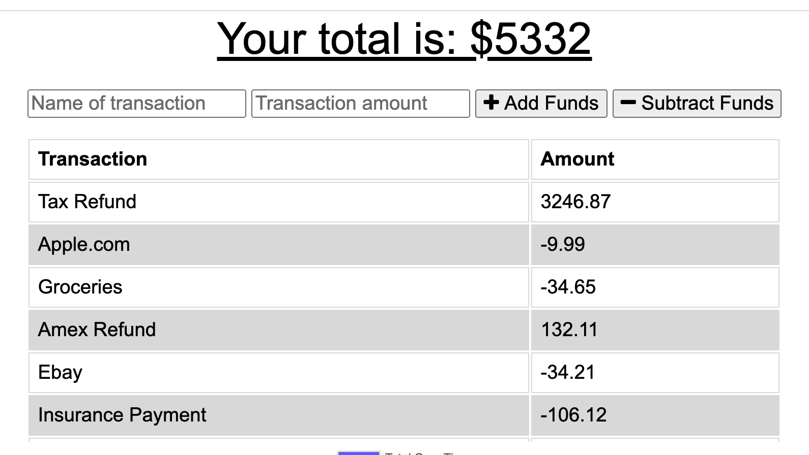
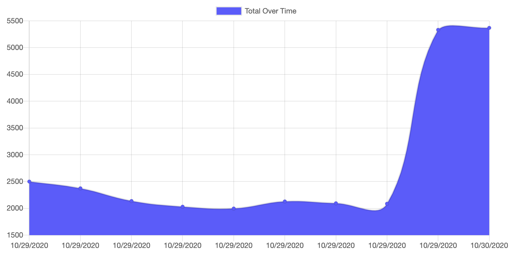

# Progressive Budget Tracker
A budget tracker application to allow for offline access and functionality.

[](https://bwaycarl.github.io/Portfolio/)
[](https://github.com/BwayCarl/Budget-Tracker/blob/main/LICENSE)
[](https://github.com/BwayCarl/Budget-Tracker/issues)
[](https://github.com/BwayCarl/Budget-Tracker/network)
[](https://github.com/BwayCarl/Budget-Tracker/stargazers)
[](https://twitter.com/intent/tweet?text=Wow:&url=https%3A%2F%2Fgithub.com%2FBwayCarl%2FBudget-Tracker)
## Homework Assignment - Unit 18
#### Rutgers Coding Bootcamp / RUT-JER-FSF-PT-06-2020-U-C

## *Table of Contents*
- [Description](#description)
- [User Story](#user-story)
- [Installation](#installation)
- [Usage](#usage)
- [Contributing](#contributing)
- [Authors](#authors)
- [Screenshots](#screenshots)
- [Contact Me](#contact-me)
- [License](#license)

## *Description* 
This assignment uses an existing Budget Tracker application from a previous in-class activity to allow for offline access and functionality.

The user will be able to add expenses and deposits to their budget with or without a connection. When entering transactions offline, they should populate the total when brought back online.

Offline Functionality:

  * Enter deposits offline

  * Enter expenses offline

When brought back online:

  * Offline entries should be added to tracker.


---


#### **User Story**
AS AN avid traveller
I WANT to be able to track my withdrawals and deposits with or without a data/internet connection
SO THAT my account balance is accurate when I am traveling

#### **Business Context**

Giving users a fast and easy way to track their money is important, but allowing them to access that information anytime is even more important. Having offline functionality is paramount to our applications success.


#### **Acceptance Criteria**
GIVEN a user is on Budget App without an internet connection
WHEN the user inputs a withdrawal or deposit
THEN that will be shown on the page, and added to their transaction history when their connection is back online.


---


## *Installation* 
 After cloning the repo, run ```npm install``` from your terminal to install the necessary dependencies:
 
  - ```mongoose ```

  - ```express ```

  - ```morgan ```

  - ```compression```

  - ```lite-server```

## *Usage*
To use locally, run ```npm start``` from your terminal and use ```localhost:3000``` in your browser.

To deploy an application with a MongoDB database to Heroku, you'll need to set up a MongoDB Atlas account and connect a database from there to your application.

The deployed application can be used at this **[Heroku Link.](https://rocky-dawn-81206.herokuapp.com/)**

## *Authors* 
 Carlos Martinez

 Frontend files provided by Rutgers Bootcamp as a starting point for the assignment.

## *Screenshots* 






## *Contact Me*
 - Github: **[BwayCarl](https://github.com/BwayCarl)**
 - LinkedIn: **[Carlos Martinez](https://www.linkedin.com/in/carlos-martinez-8702b146/)** 
 - Twitter: **[@BwayCarlDev](https://twitter.com/BwayDev)**
 - Email: **[bwaycarl@gmail.com](mailto:bwaycarl@gmail.com)**

## *License* 
This project is [MIT](https://github.com/BwayCarl/Budget-Tracker/blob/main/LICENSE) Licensed.
 
 &copy; 2020, Carlos Martinez
